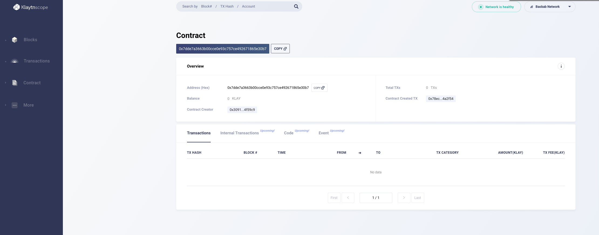
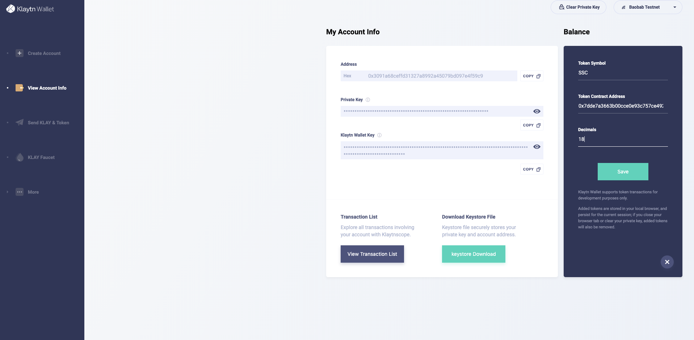
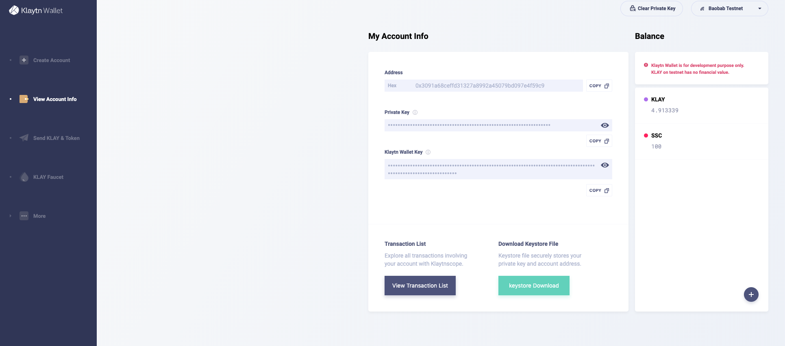

# Klaytn Study 4주차(2019.10.08)
- 클레이튼에서 ERC-20 토큰 생성하기

### ERC-20이란

ERC는 Ethereum Request for Comments를 의미한다. 그리고 20은 이 20번째 요청이라는 것이다.

이 요청은 Fabian Vogelsteller 이란 이더리움 개발자에 의해 2015년 11월 19일에 제안되었다고 한다.

이 제안에는 다음과 같이 이더리움 토큰이 따라야하는 규칙이 정의되어있다.

1. totalSupply: 총 발행량

2. transfet: 송금

3. balanceOf: 잔액

4. transferFrom: 유저간 송금

5. approve: 승인

6. allowance: 허용

그리고 klaytn은 erc-20, erc-721등 이더리움 토큰들을 지원한다. 따라서 erc-20 토큰을 klaytn에서도 만들수있다.

### ERC 20 Contract 작성 및 배포

ERC-20 Token은 Open Zeppelin, Token Factory의 Contract를 활용해 만들수있다.

`https://github.com/OpenZeppelin/openzeppelin-contracts/tree/master/contracts/token/ERC20`
`https://github.com/ConsenSys/Token-Factory/tree/master/contracts`

아래 컨트랙트는 TokenFactory 컨트랙트로 만든것이다.

`https://github.com/ssukssuk-klaytn-study/study-log/blob/master/SsukSsukCoin.sol`

위 파일을 contracts 폴더에 추가하였다

위 컨트랙트는 심볼명이 SSC, 토큰 총 발행수는 100개인 ERC20코인이다.

그런다음 migration.js에서 위파일을 import하였다.

```
const Migrations = artifacts.require("./Migrations.sol");
// const HelloWorld = artifacts.require("./HelloWorld.sol");
const SsukSsukCoin = artifacts.require('./SsukSsukCoin.sol');
module.exports = function(deployer) {
  deployer.deploy(Migrations);
  deployer.deploy(SsukSsukCoin);
  // deployer.deploy(HelloWorld);
};
```

그런다음 마찬가지로 `truffle deploy --network klaytn --reset` 명령어를 실행해준다

만약 아래와 같은 에러가 발생하면 아직 노드가 블록을 최신상태로 받지 못해서 발생한 에러임으로 console에서 `klay.blockNumber`를 통해

Klaytn Scope의 블록넘버와 같아질때까지 기다린다

```
Using network 'klaytn'.

Running migration: 1_initial_migration.js
  Replacing Migrations...
  ... 0xdb567bcdf0fcd033c8dbda5ded42c6cf3be5629f03cf910f5a7355e37e2e436b
Error encountered, bailing. Network state unknown. Review successful transactions manually.
Error: Contract transaction couldn't be found after 50 blocks
    at /Users/ms/.config/yarn/global/node_modules/truffle/build/webpack:/~/web3/lib/web3/contract.js:112:1
    at /Users/ms/.config/yarn/global/node_modules/truffle/build/webpack:/~/web3/lib/web3/filter.js:128:1
    at Array.forEach (<anonymous>)
    at /Users/ms/.config/yarn/global/node_modules/truffle/build/webpack:/~/web3/lib/web3/filter.js:127:1
    at Array.forEach (<anonymous>)
    at Object.onMessage [as callback] (/Users/ms/.config/yarn/global/node_modules/truffle/build/webpack:/~/web3/lib/web3/filter.js:125:1)
    at /Users/ms/.config/yarn/global/node_modules/truffle/build/webpack:/~/web3/lib/web3/requestmanager.js:259:1
    at Array.forEach (<anonymous>)
    at /Users/ms/.config/yarn/global/node_modules/truffle/build/webpack:/~/web3/lib/web3/requestmanager.js:258:10
    at /Users/ms/.config/yarn/global/node_modules/truffle/build/webpack:/packages/truffle-migrate/index.js:225:1
    at /Users/ms/.config/yarn/global/node_modules/truffle/build/webpack:/packages/truffle-provider/wrapper.js:134:1
    at XMLHttpRequest.request.onreadystatechange (/Users/ms/.config/yarn/global/node_modules/truffle/build/webpack:/~/web3/lib/web3/httpprovider.js:128:1)
    at XMLHttpRequestEventTarget.dispatchEvent (/Users/ms/.config/yarn/global/node_modules/truffle/build/webpack:/~/xhr2/lib/xhr2.js:64:1)
    at XMLHttpRequest._setReadyState (/Users/ms/.config/yarn/global/node_modules/truffle/build/webpack:/~/xhr2/lib/xhr2.js:354:1)
    at XMLHttpRequest._onHttpResponseEnd (/Users/ms/.config/yarn/global/node_modules/truffle/build/webpack:/~/xhr2/lib/xhr2.js:509:1)
    at IncomingMessage.<anonymous> (/Users/ms/.config/yarn/global/node_modules/truffle/build/webpack:/~/xhr2/lib/xhr2.js:469:1)
    at IncomingMessage.emit (events.js:203:15)
    at endReadableNT (_stream_readable.js:1145:12)
```

성공적으로 디플로이되면

```
Using network 'klaytn'.

Running migration: 1_initial_migration.js
  Replacing Migrations...
  ... 0x193e455790ef3cebf8d82fa0c03789431497cecaa118e9f03f1b15e53837fded
  Migrations: 0xac2f5f9b05019b0a2b08bfb38c8cd7970f39c6f8
  Deploying SsukSsukCoin...
  ... 0x78ec26a3f806f71bf9f3d3978be1b48b6ce002601d2fa2e80f4b6e2af14a2f54
  SsukSsukCoin: 0x7dde7a3663b00cce0e93c757ce492671865e30b7
Saving successful migration to network...
  ... 0x7f5c82cc8c4f4503b7005c95bab28a2dfbd91024a6d2e1c17a17cf78ed80ebad
Saving artifacts...
```

이렇게 `0x7dde7a3663b00cce0e93c757ce492671865e30b7`라는 토큰의 contract주소가 나온다.

### 확인하기
[KlaytnScope](https://baobab.scope.klaytn.com)로 접속을 해서 위에서 생성한 토큰 contract 주소를 검색한다.



위와 같이 contract 정보와 Contract Creator가 본인의 주소임을 확인할수 있다.

그 다음 [KlaytnWallet](https://baobab.wallet.klaytn.com)로 접속해서 본인 pk를 이용해 로그인을 한다.

그런 다음 우측 하단에 + 버튼을 클릭해서 정보를 입력한다



그런 다음 save버튼을 누르면 방금 생성한 토큰이 자신의 주소에 들어있는 것을 볼수있다.

